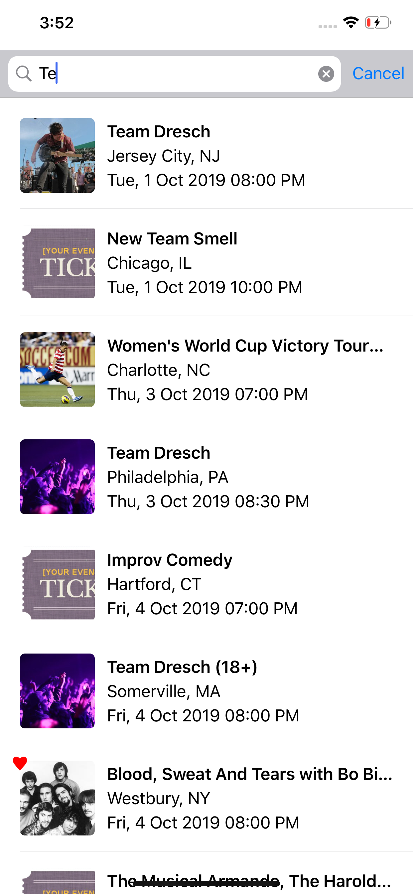
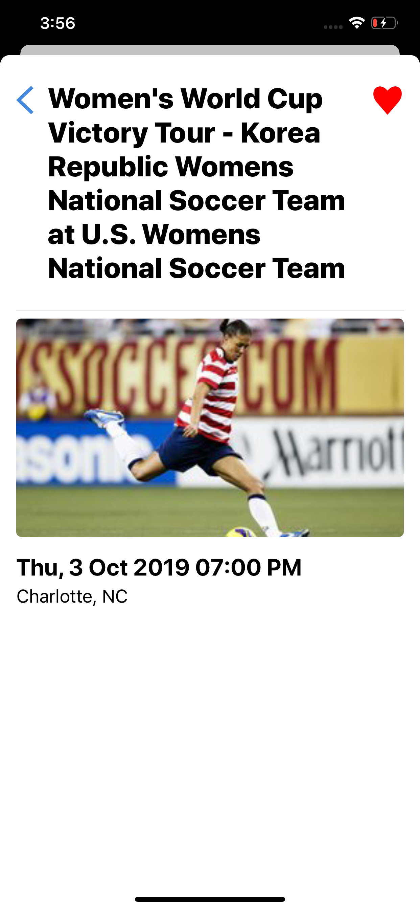
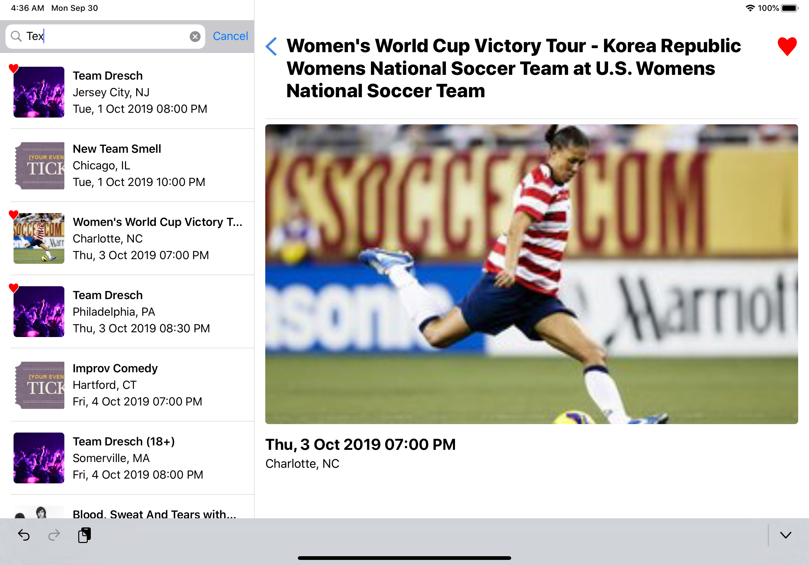

# Optimal Dazzle
Implements a look ahead search against the Seat Geek API. 

## Details

1. Using a Split View Controller to allow iPad and iOS versions using the same code base
2. User types ahead that triggers a new search from the API
3. Implemented without the navigation controller as the detail view did not show one
4. The detail view appears as a popover on the iPhone instead of a full detail view
5. MVVM is the architecture of choice to encourage unit testing
6. Developed using Xcode 11 and targets iOS 12.4
7. Dark mode may not appear correctly
8. If the image url is not supplied by the API a stock image is displayed, as there are many events without one

## Caching mechanism

- The favourities are cached in Core Data and are loaded into a hash table (Set) on startup to allow for O(1) search efficiency
- Images are cached always in the documents folder. If the table view does not find them there it queues a download NSOperation that fetcehs the image and saves it in the cache
- Query results and details of events are not cached

## Unit Tests

- The design uses MVVM architecture and created a simple test to retrieve verify that all events starting with "a" have an image. They do not, the url is missing in many cases. 

# Screen Captures

  

 